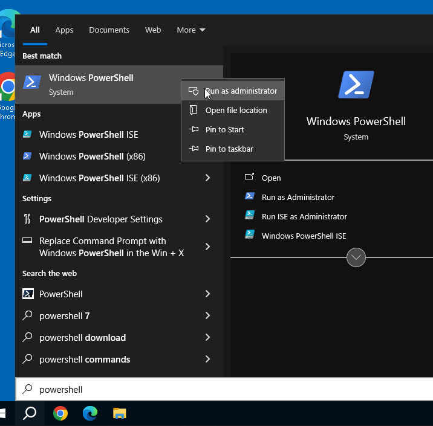

## Windows AutoLogin Configuration Script

A PowerShell script that simplifies the process of configuring automatic login on Windows 10 and Windows 11 systems. 

## Features

- Configure automatic login for any local Windows user account
- Remove existing automatic login configuration
- Real-time credential validation before making system changes

## Prerequisites

- Windows 10 or Windows 11 operating system
- PowerShell 5.1 or later
- Administrator privileges

## Usage

There are two ways to run this script:

### Method 1: Run directly from GitHub

1. Launch PowerShell with administrator privileges  

  

2. Copy and run command below: 

```powershell
iex ((New-Object Net.WebClient).DownloadString('https://raw.githubusercontent.com/bradsec/winautologin/refs/heads/main/autologin.ps1'))
```

3. Select option from menu.


### Method 2: Local Execution

1. Download `autorun.ps1` from this repository
2. Open PowerShell as Administrator
3. Navigate to the script directory
4. Run the script:

```powershell
.\autorun.ps1
```

If you encounter execution policy restrictions, you can bypass them for just this script:

```powershell
powershell.exe -ExecutionPolicy Bypass -File .\autorun.ps1
```

## Security Note
This script stores login credentials in the Windows Registry. While this is required for the auto-login functionality to work, be aware that storing passwords in the registry may pose a security risk. Suggest using this in test or non-production secure environments only.